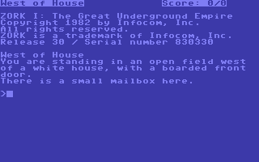
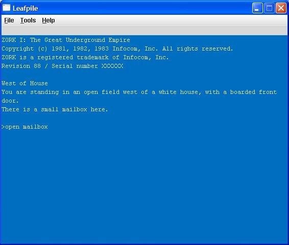

# zAI-Machine

A C# Z-Machine interpreter implementing the Z-Machine Standards Document
v1.1, with Quetzal 1.4 save support and Blorb 2.0.4 resource loading.
Features seven selectable vintage GUI themes rendered pixel-precisely
with SkiaSharp on Avalonia UI.

Authored by Claude Code, cleaned up by a human.

## Features

- **Z-Machine versions 1–8** — full opcode coverage including V5
  extended opcodes, V6 windowing, and Standard 1.1 additions
  (true colour, mouse, Unicode, `@buffer_screen`)
- **Quetzal 1.4** — portable save/restore via IFF container format
  with CMem compression
- **Blorb 2.0.4** — resource loading for pictures, sounds, and
  adaptive palettes; auto-detection of `.blorb`/`.zblorb` files
- **Seven vintage themes** — C64 Classic, Modern C64, Apple II,
  DOS Green, DOS Amber, DOS Color, Amiga Workbench
- **Pixel-precise rendering** — SkiaSharp bitmap fonts and retro
  chrome, not just coloured terminal text
- **Interactive debugger** — step into/over, breakpoints (address,
  conditional, opcode), watch expressions, execution trace, memory
  dump, call stack inspection
- **Instruction trace** — optional lightweight trace callback for
  diagnostics without debugger overhead
- **Structured error reporting** — `ZMachineException` with PC
  address and opcode context for every illegal operation

## Screenshots

| C64 Classic | Modern C64 |
|---|---|
|  |  |

## Requirements

- [.NET 10 SDK](https://dotnet.microsoft.com/download) or later
- No additional dependencies — NuGet packages restore automatically

## Build

```bash
# Clone and build
git clone https://github.com/porcellian/zAI-Machine.git
cd zAI-Machine
dotnet build

# Run tests
dotnet test

# Launch the GUI
dotnet run --project src/ZMachine.App
```

## Release Builds

Single-file self-contained executables for each platform:

```bash
# Windows (x64)
dotnet publish src/ZMachine.App -c Release -r win-x64 --self-contained -p:PublishSingleFile=true -o publish/win-x64

# macOS (Apple Silicon)
dotnet publish src/ZMachine.App -c Release -r osx-arm64 --self-contained -p:PublishSingleFile=true -o publish/osx-arm64

# macOS (Intel)
dotnet publish src/ZMachine.App -c Release -r osx-x64 --self-contained -p:PublishSingleFile=true -o publish/osx-x64

# Linux (x64)
dotnet publish src/ZMachine.App -c Release -r linux-x64 --self-contained -p:PublishSingleFile=true -o publish/linux-x64
```

## Usage

```bash
# Run a story file
dotnet run --project src/ZMachine.App -- path/to/story.z5

# Run a Blorb file (auto-extracts Z-code executable)
dotnet run --project src/ZMachine.App -- path/to/game.zblorb
```

Place story files in the `stories/` directory for easy access.

### Supported Formats

| Extension | Format |
|---|---|
| `.z1`–`.z8` | Raw Z-Machine story files (versions 1–8) |
| `.blorb`, `.zblorb`, `.blb`, `.zlb` | Blorb resource files (with or without embedded Z-code) |

### Themes

Select a theme from the application menu. Available themes:

| Theme | Style |
|---|---|
| C64 Classic | Commodore 64 blue-on-blue with PETSCII-style font |
| Modern C64 | Updated C64 palette with improved readability |
| Apple II | Green phosphor on black, 40-column monospaced |
| DOS Green | IBM MDA green phosphor monochrome |
| DOS Amber | IBM MDA amber phosphor monochrome |
| DOS Color | EGA 16-colour palette, 80×25 text mode |
| Amiga Workbench | Amiga OS blue/white/orange Workbench palette |

## Project Structure

```
zAI-Machine/
├── src/
│   ├── ZMachine.Core/     # Interpreter engine — no UI dependencies
│   ├── ZMachine.IO/       # I/O abstractions, themes, rendering
│   └── ZMachine.App/      # Avalonia GUI host
├── tests/
│   └── ZMachine.Tests/    # xUnit tests (1600+)
├── specs/                 # Specification documents
├── stories/               # Story files for testing
├── examples/              # Screenshot examples
└── docs/                  # Development journal
```

## Specifications

This interpreter implements:

- **Z-Machine Standard 1.1** — the complete virtual machine
  specification including all amendments
- **Quetzal 1.4** — the portable save-file format (IFF container,
  `IFZS` form type)
- **Blorb 2.0.4** — the resource format for pictures, sounds, and
  metadata (IFF container, `IFRS` form type)

The specification documents are in `specs/` for reference.

## Supported Versions

| Version | Era | Notes |
|---|---|---|
| V1 | 1979 | Earliest Infocom format, limited features |
| V2 | 1981 | Abbreviations, shift-lock text encoding |
| V3 | 1982–86 | Most Infocom titles — status line, split screen |
| V4 | 1985–87 | Timed input, bold/italic, larger memory |
| V5 | 1987–89 | Extended opcodes, colours, undo, Unicode |
| V6 | 1988–90 | Full windowing, pictures, mouse, sound |
| V7 | — | Extended address space (large V5 variant) |
| V8 | — | Extended address space (up to 512K) |

## Testing

```bash
# Run all tests
dotnet test

# Run a specific test class
dotnet test --filter "FullyQualifiedName~CzechConformanceTests"

# Run the czech.z5 conformance suite (406 opcode tests)
# Place czech.z5 in stories/ — tests skip cleanly if absent
```

The test suite includes:
- **1600+ unit tests** covering opcodes, text encoding/decoding,
  memory model, object table, IFF parsing, Quetzal save/restore,
  Blorb resource loading, disassembly, and header configuration
- **Czech conformance** — the standard Z-Machine test suite
  (406 tests + 19 print checks, 0 failures)
- **Infocom compatibility** — boot, display, and gameplay tests
  against real story files
- **Stress tests** — 100 random inputs per story file

## Known Limitations

- **V6 without Blorb**: V6 games (Arthur, Journey, Shogun) crash
  during startup without Blorb picture resources — their init
  routines configure screen/picture data that requires loaded images
- **Save/restore**: Quetzal read/write is implemented but not yet
  wired into the `@save`/`@restore` opcodes (stubs return failure)
- **Sound playback**: Sound engine interface is defined but no audio
  backend is connected yet
- **Timed input**: `@read` with timeout callback is parsed but the
  timer is not implemented

## License

[MIT](LICENSE)
